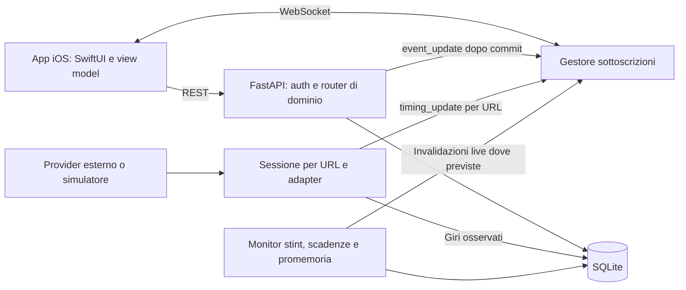

# Race Manager — Architettura e mappa dei file

Aggiornamento: 16 settembre 2026. Questa mappa descrive l'implementazione presente nel repository, verificata leggendo backend, client e test. Le specifiche accademiche RASD e DD preparate separatamente contengono anche requisiti e decisioni proposte: non sono una prova di conformità del codice. Questa mappa documenta la nuova semantica della bandiera rossa in stop.

Per API e gestione operativa vedere la [documentazione backend](python_scraper_server/DOCUMENTATION.md); per navigazione, networking e UI vedere la [documentazione iOS](client_ios_app/KartTimingApp/DOCUMENTATION.md).

## 1. Struttura del sistema

Il sistema è client–server: app nativa SwiftUI, backend FastAPI organizzato in moduli, database SQLite sullo stesso host del backend. I livelli presentazione, logica e persistenza non sono tre servizi distribuiti. Il client usa REST per leggere/modificare risorse e WebSocket per ricevere timing e invalidazioni dello stato evento.

Il backend mantiene due associazioni distinte: socket → URL del timing e socket → evento. Più client sullo stesso URL condividono l'acquisizione; cambiare sorgente non cambia quella degli altri client. I messaggi `event_update` sollecitano nuove letture REST, mentre `timing_update` contiene la tabella acquisita.

Le mappe di sottoscrizione e le sessioni sono in memoria nel processo Python. Il deployment attuale va considerato a singolo worker: aggiungere worker non fornisce automaticamente broadcast condivisi o coordinamento dei monitor.

## 2. Backend — `python_scraper_server/`

| Percorso | Responsabilità effettiva |
| --- | --- |
| `main.py` | Montaggio router, CORS, file statici, lifespan e avvio Uvicorn sulla porta 8000. All'avvio inizializza DB, chiude eventi scaduti, pulisce snapshot e avvia Bonjour e monitor; allo shutdown cancella monitor e ferma sessioni/discovery. |
| `config.py` | Host consentiti, URL simulatore, percorsi, polling ogni 3 s, massimo 5 sorgenti e grace period di 15 s senza iscritti. |
| `requirements.txt` | Dipendenze Python; comprende FastAPI, SQLAlchemy, Playwright, autenticazione, Zeroconf e fpdf2. |
| `auth/router.py`, `schemas.py` | Registrazione, login, refresh/logout, profilo, avatar, cambio password ed eliminazione account. |
| `auth/dependencies.py`, `roles.py` | Identità risolta sul DB corrente e gerarchia `viewer < user < race_director < admin`. I controlli di appartenenza restano nelle operazioni di dominio. |
| `auth/jwt.py`, `password.py` | Access JWT HS256, refresh token casuali salvati come hash SHA-256, password con hash bcrypt. |
| `auth/token.py` | Verifica del token WebSocket e dell'account/ruolo corrente; non è un file di modelli Pydantic. |
| `auth/admin_router.py` | Ricerca utenti, cambio ruolo, configurazione liberatorie, anteprima, elenco firme, PDF e rimozione firme per amministratori. |
| `db/database.py`, `models.py` | Sessioni SQLAlchemy, foreign key SQLite abilitate, inizializzazione/migrazioni manuali, seed e modelli persistenti. |
| `events/router.py`, `schemas.py` | CRUD eventi, iscrizioni individuali/team, ammissioni, conferme, modifiche, uscite e firme liberatorie. |
| `events/lifecycle.py` | Chiusura degli eventi scheduled/started a 48 ore dalla data programmata; controllo iniziale e ogni 30 s. |
| `live/router.py`, `schemas.py` | Stato evento, kart, pit, messaggi, penalità, tipi di penalità e proiezione del kart dell'utente. |
| `live/stint_monitor.py` | Valutazione automatica del limite stint circa ogni secondo, senza dipendenza dai client; marker e penalità nella stessa transazione. |
| `notifications/router.py`, `schemas.py` | Notifiche persistenti e operazioni riservate al destinatario. |
| `notifications/reminders.py` | Promemoria per eventi nei prossimi 7 giorni, deduplicati da una tabella persistente; monitor ogni 30 s. |
| `results/router.py`, `schemas.py` | Import/rimozione risultati ufficiali per admin, classifiche, storico personale e statistiche giri. |
| `kartodromi/router.py`, `schemas.py` | Circuiti, immagini, configurazione URL, risultati personali circuito; durante un aggiornamento disconnette i client della sorgente interessata. |
| `scraper/base.py`, `factory.py` | Contratto `setup/scrape/teardown` e selezione adapter per host. |
| `scraper/providers/` | Apex Timing, RaceFacer, estrattore HTML generico e simulatore da JSON locale. Il fallback generico non aggira l'allowlist WebSocket. |
| `scraper/session.py` | Una sessione/thread per URL, conteggio iscritti, ultimo payload, polling e rilascio differito senza iscritti. |
| `scraper/storage.py` | Scrittura atomica degli snapshot JSON; questi file vengono ripuliti e non sono uno storico permanente. |
| `scraper/lap_tracker.py` | Rileva incrementi del contatore giri e salva l'ultimo giro osservato; associa il circuito all'evento started più recente tramite il nome della location. |
| `ws/router.py`, `manager.py` | Comandi WebSocket, autenticazione/rivalidazione, mappe URL/evento, broadcast e cleanup connessioni. |
| `services/pdf_generator.py` | Genera PDF delle liberatorie a partire dai record e dalla firma disegnata. |
| `services/pdf_router.py` | Upload autenticato e link browser temporanei: 10 MiB, validità un'ora, download tramite link non autenticato. |
| `discovery/bonjour.py` | Annuncio mDNS `_karttiming._tcp.local.` sulla rete locale. |
| `tests/` | Suite unittest per accessi, iscrizioni, notifiche, monitor, WebSocket, circuiti, statistiche e PDF. |

### 2.1 Modello persistente

| Modelli | Collegamenti e vincoli principali |
| --- | --- |
| `User`, `RefreshToken` | Username/email univoci; refresh associati all'utente, con hash, scadenza e revoca. |
| `Event`, `Kartodromo` | L'evento contiene `location`, non una foreign key al circuito. Stato evento e stato turno sono separati. |
| `EventRegistration` | Unicità `(user_id, event_id)` per account collegati; `user_id` nullable per email senza account. Team rappresentati da `team_id` condiviso, senza tabella Team. |
| `SignedRelease` | Un record per `(event_id, user_id)`, dati anagrafici e immagine firma Base64. Non contiene una versione immutabile separata del testo firmato. |
| `LiveKartAssignment` | Unicità evento/kart; entry/team, stato pit, secondi accumulati, ultimo avvio e marker di penalità stint. |
| `PenaltyType`, `RacePenalty`, `RaceMessage` | Configurazione penalità e soglie avvisi, decisioni per evento/kart e messaggi globali o mirati. |
| `EventResult`, `KartodromoResult`, `LapTime` | Classifiche evento, risultati personali circuito e giri osservati sono dati distinti. |
| `Notification`, `EventReminderDelivery` | Contenuto per destinatario e marker user/event per non rigenerare il promemoria dopo lettura/cancellazione o riavvio. |

### 2.2 Stato gara e durata dei dati

- `Event.status`: `scheduled`, `started`, `finished`; riguarda l'evento organizzativo.
- `Event.race_status`: `not_started`, `running`, `paused`, `stopped`; riguarda il turno e i timer. `paused` resta riconosciuto dal modello e dal monitor, ma non viene più impostato dalla bandiera rossa.
- `red_flag` e `checkered_flag`: entrambi impostano `stopped` e congelano i timer preservando i secondi accumulati. Non chiudono automaticamente l'evento.
- `green_flag`: avvia/riprende solo se lo stato non è `stopped`; il controllo attuale non è limitato al solo stato `paused`.
- `custom` con testo normalizzato `Gara Iniziata` o `Turno Iniziato`: avvio esplicito, reset degli stint, rientro in pista dei kart assegnati e nuovo stato `running`.
- I risultati ufficiali restano nel DB dopo un riavvio. Un import valido sostituisce tutti quelli dell'evento, anche di altri tipi di sessione; cancellazioni esplicite e foreign key possono rimuoverli.
- I link PDF temporanei scadono dopo un'ora; questo non cancella i risultati o le firme nel DB.
- L'acquisizione timing può fermarsi senza iscritti: la raccolta giri non garantisce uno storico completo.

## 3. Client — `client_ios_app/KartTimingApp/KartTimingApp/`

Il client segue un'organizzazione MVVM con stato condiviso di autenticazione/ambiente, view model di feature e servizi di rete. Le autorizzazioni della UI non sostituiscono i controlli server.

| Percorso | Responsabilità effettiva |
| --- | --- |
| `App/KartTimingAppApp.swift` | Entrypoint e scelta della root in base alla sessione. |
| `App/AppEnvironment.swift` | Endpoint remoto HTTPS, modalità sviluppo con host/porta locali persistiti e richiesta di apertura evento da notifica. |
| `Auth/AuthService.swift`, `AuthState.swift`, `KeychainService.swift`, `LoginView.swift` | Accesso, sessione/refresh, profilo/avatar, Keychain e ingresso ospite tramite account viewer. |
| `Services/NetworkService.swift` | Actor HTTP, refresh condiviso dopo 401, cache GET opzionale e deduplicazione richieste; decoding JSON fuori dal main actor. |
| `Services/ServerBrowser.swift` | Discovery locale tramite NetServiceBrowser. |
| `Services/GPSSpeedMonitor.swift` | Velocità GPS locale in km/h, permesso when-in-use e scarto campioni vecchi; non invia telemetria al backend. |
| `Models/Models.swift`, `UserRole.swift` | DTO e ruoli; decodifica JWT per la UI, senza verifica crittografica client. |
| `Features/Home/` | TabView, dashboard, notifiche e navigazione verso un evento. La sessione guest mostra solo Timing. |
| `Features/Events/` | Root/lista/dettaglio evento, form, registrazione/team, gestione organizzatore, liberatorie, informazioni pagamento e import risultati. |
| `Features/Events/PDFViewer.swift` | Contiene `PDFBrowser`: carica i byte sul server e apre il link temporaneo nel browser; non è un lettore PDF incorporato. |
| `Features/Timing/KartTimingManager.swift` | WebSocket, heartbeat, stato connessione/sorgente, riconnessione dopo rinnovo token e dispatch aggiornamenti. |
| `Features/Timing/TimingView.swift`, `TimingPilotView.swift` | Selezione/consultazione timing e rappresentazione della classifica. |
| `Features/Live/LiveRootView.swift`, `LiveViewModel.swift` | Coordinamento evento live, fetch mirati, accorpamento refresh, correlazione richieste e scarto risposte di contesti precedenti. |
| `Features/Live/Models/LiveModels.swift` | Kart, messaggi, penalità, proiezione personale e stato locale del cambio pilota. |
| `Features/Live/Director/` | `DirectorLiveView`, `ClassificaLiveView`, `PitWallLiveView`, `AssegnazioneKartView`, `GestioneLiveView`, `DirectorMessaggiView`: classifica, pit wall, assegnazioni e comandi. |
| `Features/Live/User/` | `UserLiveView`, `PilotLiveView`, `TeamLiveView`, `UserMessaggiView`: viste pilota/team e messaggi; stima GPS nella vista pilota. |
| `Features/Analisi/` | Storico, classifiche, grafici Swift Charts, statistiche disponibili e generazione PDF con `ClassificationPDFGenerator.swift`. Non è più una sezione placeholder. |
| `Features/Admin/` | Ricerca/dettaglio utenti, ruoli, analisi amministrativa, circuiti e relativo form/view model. |
| `Features/Settings/` | Profilo, password, ambiente, logout e `GestionePenalitaView` per la configurazione delle penalità. |
| `UI/Color+Theme.swift`, `Info.plist` | Tema e metadati/permessi piattaforma. |

Non esiste una directory client `Network/`: autenticazione e rete sono in `Auth/` e `Services/`. Il target Xcode attuale indica iOS 26.1; non è stata verificata compatibilità con versioni precedenti.

## 4. Flussi e confini

1. REST autenticato risolve account e ruolo correnti; le mutazioni salvano record e possono inviare invalidazioni WebSocket.
2. Il client seleziona separatamente sorgente timing ed evento. Gli aggiornamenti mirati pit/messaggi/penalità evitano un caricamento completo quando il protocollo fornisce il dettaglio.
3. `X-Request-ID` consente al client di riconoscere la propria invalidazione; non è una chiave di idempotenza server.
4. L'import CSV ufficiale è admin-only. Il client genera la rappresentazione PDF, poi la pubblica temporaneamente per l'apertura browser.
5. Firma, conferma iscrizione e pagamento sono concetti separati. Non sono implementati pagamento integrato, invio email di invito o push APNs.

## 5. Discrepanze da conoscere

- `LiveViewModel.syncRaceTimesFromMessages` chiude il cronometro derivato dai messaggi solo su `checkered_flag`: non è ancora allineato alla rossa per quel calcolo UI, anche se il backend ferma correttamente gli stint e la UI offre «Inizia Turno» dopo la rossa.
- Il client contiene una chiamata per autodichiarare il miglior giro evento, ma nel router risultati non è registrato il relativo POST. L'autodichiarazione per circuito ha invece un endpoint.
- `UserRole.canChangeURL` limita il permesso a director/admin, mentre il WebSocket ammette tutti i ruoli autenticati alla selezione della propria sorgente.
- Il backend espone alcune letture evento senza autenticazione e la registrazione richiede identità ma non un ruolo minimo `user`: non descrivere la restrizione guest della UI come protezione completa delle API.
- La sottoscrizione evento valida un ID positivo, non una policy completa di accesso. Il filtro kart dei messaggi è un parametro di lettura, non un vincolo di appartenenza del chiamante.
- `main.py` monta l'intera directory `data/` sotto `/static`, non soltanto immagini. Lo storage privato non è quindi isolato da quel mount nella configurazione attuale.
- La scadenza automatica cambia solo `Event.status`: non pubblica risultati e non riconcilia `race_status`/timer.

Questi punti sono documentati come stato attuale; questo aggiornamento non modifica il codice applicativo. RASD/DD e rispettive versioni LaTeX richiedono una revisione separata per recepire la nuova semantica della bandiera rossa.

## 6. Verifiche

Eseguita la suite backend con `python -m unittest discover -s tests -v`: **69 test superati** il 16 settembre 2026. La suite usa fixture/database isolati per le verifiche; non equivale a un collaudo con provider reali, carico concorrente o dispositivi iOS. La revisione client è basata sul codice, senza build Xcode o test su dispositivo.
